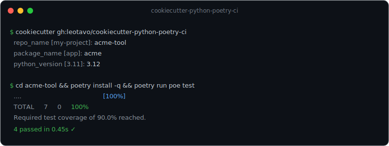

# cookiecutter-python-poetry-ci

A [Cookiecutter](https://www.cookiecutter.io/) template for production-ready Python projects: **Poetry**, a `src/` layout, **Ruff** (lint **and** format), **mypy**, **pytest** with coverage, **pre-commit**, and a green **GitHub Actions** CI from the first commit.

[](https://github.com/leotavo/cookiecutter-python-poetry-ci/actions/workflows/ci.yml)
[](LICENSE)

[](https://www.cookiecutter.io/)

## Why

Starting a Python project means re-wiring the same dozen tools every time. This template gives you a project that **lints, formats, type-checks, tests and passes CI from the first commit** — so you write code, not config.

The template itself is **CI-verified**: every change re-generates a project with `cookiecutter` and runs its full check suite on **Python 3.11–3.14** across **Linux, macOS and Windows**.

## Demo



<details>
<summary>Example session (text)</summary>

```text
$ cookiecutter gh:leotavo/cookiecutter-python-poetry-ci
  project_name [My Project]: Acme Tool
  repo_name [my-project]: acme-tool
  package_name [app]: acme
  python_version [3.11]: 3.12

$ cd acme-tool && poetry install -q && poetry run poe test
  ....                                          [100%]
  TOTAL     7     0     100%
  Required test coverage of 90.0% reached.
  4 passed in 0.45s
```

</details>

## Quick start

```bash
pipx install cookiecutter           # or: pip install cookiecutter
cookiecutter gh:leotavo/cookiecutter-python-poetry-ci
cd <repo_name>
poetry install
poetry run pytest
```

## What you get

- **Poetry** for dependency & build management, with a `src/` layout
- **Ruff** as the single linter **and** formatter — no Black/isort overlap
- **mypy** with sensible strictness (`check_untyped_defs`, `warn_redundant_casts`, …)
- **pytest** + **coverage**, with smoke tests included
- **pre-commit** hooks kept in sync with CI
- **GitHub Actions** CI: `poetry install` → `ruff check` → `ruff format --check` → `mypy` → `pytest`
- A minimal CLI entry point (`python -m <package_name>`) and `docs/` (git-flow, CI status checks)
- Governance defaults: `CODE_OF_CONDUCT.md`, `SECURITY.md`, Dependabot, `.gitattributes`, and a least-privilege `permissions` block in CI

### Generated structure

```text
<repo_name>/
├── .github/
│   ├── dependabot.yml
│   └── workflows/
│       └── ci.yml
├── .gitattributes
├── .gitignore
├── .pre-commit-config.yaml
├── CODE_OF_CONDUCT.md
├── CONTRIBUTING.md
├── LICENSE
├── README.md
├── SECURITY.md
├── docs/
│   ├── ci-status-checks.md
│   └── git-flow.md
├── poetry.toml
├── pyproject.toml
├── src/<package_name>/
│   ├── __init__.py
│   └── __main__.py
└── tests/test_smoke.py
```

## Template options

| Prompt | Default | Description |
|---|---|---|
| `project_name` | `My Project` | Human-readable project name |
| `repo_name` | `my-project` | Repository / root directory name |
| `package_name` | `app` | Importable package under `src/` |
| `description` | … | Short project description |
| `author_name` / `author_email` | … | Package author |
| `license` | `MIT` | License identifier |
| `python_version` | `3.11` | Minimum Python version |
| `gh_owner` | `leotavo` | GitHub owner, used in the repository URL |
| `use_ci` | `y` | Include the GitHub Actions CI workflow (`n` to omit) |
| `use_precommit` | `y` | Include the pre-commit config (`n` to omit) |

## License

[MIT](LICENSE) © Leonardo Trindade
